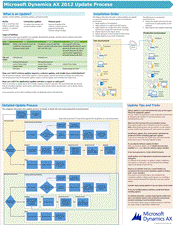

# Apply updates and hotfixes 

_**Applies To:** Microsoft Dynamics AX 2012 R3, Microsoft Dynamics AX 2012 R2, Microsoft Dynamics AX 2012 Feature Pack, Microsoft Dynamics AX 2012_

This topic describes the types of updates that are available for Microsoft Dynamics AX 2012 and the deployment process for updates. Updates include hotfixes, cumulative updates, service packs, and feature packs.

> [!IMPORTANT]
> 
We strongly recommend that you install all updates in a test or backup environment before you install them in production environments. Then validate the update against the implementation, customizations, data, and processes that are currently used in your organization.

Because of the unique architecture of Microsoft Dynamics AX implementations, many issues can be encountered when you install a code fix. We recommend that you test all business scenarios and customizations to verify that the update is behaving as expected, that the update is not affecting other areas, and that the resulting data is correct.

This topic supplements the information that is included in specific updates.

## Deployment process for updates

Different updates can affect different components of Microsoft Dynamics AX. When you install an update, the update installer indicates which components of Microsoft Dynamics AX are affected by the update.

If an update affects multiple components, we recommend that you follow these steps to apply the update:

1.  Apply the database updates to a single database, apply the Application Object Server (AOS) updates to a single local AOS instance that is associated with the updated database, and apply the client updates to a single local client. Then get the environment running, and validate all business scenarios.
    

    > [!IMPORTANT]
    > 
Because the model store in Microsoft Dynamics AX 2012 and the Microsoft Dynamics AX 2012 Feature Pack is part of the business database, when you update the database, you also import all code updates.

2.  Apply the database updates to any additional databases by exporting and importing the model store. After your system has been compiled in the test environment, we recommend that you use the Windows PowerShell Import-AXModelStore cmdlets to deploy changes to the production environment. This approach requires the least downtime for your production system. For more information, see [Deploying Customizations Across Microsoft Dynamics AX 2012 Environments (White paper)](deploying-customizations-across-microsoft-dynamics-ax-2012-environments-white-paper.md).

3.  Apply the AOS updates to any additional AOS instances.
    

    > [!IMPORTANT]
    > 
You cannot apply updates to remote AOS instances by using AXUpdate.exe. You must apply the updates locally.

4.  Deploy changes to Microsoft SQL Server Reporting Services, and then to Enterprise Portal for Microsoft Dynamics AX.

5.  Deploy changes to any retail components.

6.  Mass deploy the updates to your clients. For more information, see [Run AXUpdate in silent mode](run-axupdate-in-silent-mode.md).

> [!IMPORTANT]
> 
We strongly recommend that all computers in an environment be updated together.

View or download a detailed poster of the update process.

<table>
<colgroup>
<col style="width: 50%" />
<col style="width: 50%" />
</colgroup>
<thead>
<tr class="header">
<th>
Title
</th>
<th>
Description
</th>
</tr>
</thead>
<tbody>
<tr class="odd">
<td>
<strong>Microsoft Dynamics AX 2012 Update Process</strong>

<a href="http://go.microsoft.com/fwlink/?linkid=306777">Zoom in to the diagram at full detail by using Zoom.it from Microsoft</a>

<a href="http://go.microsoft.com/fwlink/?linkid=306776">Downloadable PDF and Microsoft Visio versions</a>
</td>
<td>
This poster describes the types of updates, the recommended installation order, and the detailed update process for Microsoft Dynamics AX 2012. It also provides tips and tricks for managing updates.
</td>
</tr>
</tbody>
</table>

It is important that day-to-day operation of your business be disrupted as little as possible when you install hotfixes. We recommend that you become familiar with the Microsoft Service Management Functions [Operations Framework Guide](http://www.microsoft.com/technet/solutionaccelerators/cits/mo/smf/default.mspx). The Operations Framework guide contains information about how to define processes, establish best practices, and manage IT solutions.

## Evaluate the update, and determine which types of hotfixes it contains

Before you install an update, review the knowledge base (KB) article that is released together with it. The KB article helps you determine whether the update applies to your environment, and how the update might affect your environment.

> [!NOTE]
> 
If you customized your environment before you received an update, thoroughly review the KB article that describes it. Investigate any objects that are affected by the hotfix to determine whether the changes that are implemented by the hotfix should be merged with customizations in a higher layer, such as BUS, VAR, USR, or CUS.

To determine what type of hotfix an update contains, see the section [Apply updates and hotfixes](apply-updates-and-hotfixes.md)

To determine the build number of the Microsoft Dynamics AX version that you are running, see the section How can I determine which version and build number I’m running?

Microsoft Dynamics AX 2012 R3 :

<table>
<colgroup>
<col style="width: 25%" />
<col style="width: 25%" />
<col style="width: 25%" />
<col style="width: 25%" />
</colgroup>
<thead>
<tr class="header">
<th>
Version
</th>
<th>
Build
</th>
<th>
Availability
</th>
<th>
KB Number
</th>
</tr>
</thead>
<tbody>
<tr class="odd">
<td>
Recent kernel build
</td>
<td>
6.3.6000.8881
</td>
<td>
Recent
</td>
<td>
KB4511784
</td>
</tr>
<tr class="even">
<td>
February 2019 Update
</td>
<td>
6.3.6000.8149
</td>
<td>
20 Apr 2019
</td>
<td>
Feb 2019 Release
</td>
</tr>
<tr class="odd">
<td>
Cumulative Update 13
</td>
<td>
6.3.6000.149
</td>
<td>
13 Sep 2017
</td>
<td>
KB4032175
</td>
</tr>
<tr class="even">
<td>
Cumulative Update 12
</td>
<td>
6.3.5000.138
</td>
<td>
21 Nov 2016
</td>
<td>
KB3199741
</td>
</tr>
<tr class="odd">
<td>
Cumulative Update 11
</td>
<td>
6.3.4000.127
</td>
<td>
29 Jun 2016
</td>
<td>
KB3157865
</td>
</tr>
<tr class="even">
<td>
Cumulative Update 10
</td>
<td>
6.3.3000.110
</td>
<td>
24 Nov 2015
</td>
<td>
KB3102920
</td>
</tr>
<tr class="odd">
<td>
Cumulative Update 9
</td>
<td>
	6.3.2000.326
</td>
<td>
08 Jun 2015
</td>
<td>
KB3063879
</td>
</tr>
<tr class="even">
<td>
Cumulative Update 8
</td>
<td>
6.3.1000.309
</td>
<td>
18 Nov 2014
</td>
<td>
KB2998197
</td>
</tr>
<tr class="odd">
<td>
RTM
</td>
<td>
6.3.164.0
</td>
<td>
Apr 2014
</td>
<td>
Customer / Partner source
</td>
</tr>
</tbody>
</table>

Microsoft Dynamics AX 2012 R2 (Mainstream Support ended):

<table>
<colgroup>
<col style="width: 25%" />
<col style="width: 25%" />
<col style="width: 25%" />
<col style="width: 25%" />
</colgroup>
<thead>
<tr class="header">
<th>
Version
</th>
<th>
Build
</th>
<th>
Availability
</th>
<th>
KB Number
</th>
</tr>
</thead>
<tbody>
<tr class="odd">
<td>
Latest kernel build
</td>
<td>
6.2.3000.5768
</td>
<td>
17 Oct 2018
</td>
<td>
KB4465169
</td>
</tr>
<tr class="even">
<td>
Cumulative Update 9
</td>
<td>
6.2.3000.110
</td>
<td>
24 Sep 2015
</td>
<td>
KB3092626
</td>
</tr>
<tr class="odd">
<td>
Cumulative Update 8
</td>
<td>
6.2.2000.14
</td>
<td>
06 Mar 2015
</td>
<td>
KB3042171
</td>
</tr>
<tr class="even">
<td>
Cumulative Update 7
</td>
<td>
6.2.1000.4051
</td>
<td>
01 Nov 2013
</td>
<td>
KB2885603
</td>
</tr>
<tr class="odd">
<td>
Cumulative Update 6
</td>
<td>
6.2.1000.1437
</td>
<td>
26 Jun 2013
</td>
<td>
KB2850972
</td>
</tr>
<tr class="even">
<td>
Cumulative Update 1
</td>
<td>
6.2.1000.156
</td>
<td>
26 Feb 2013
</td>
<td>
KB2807685
</td>
</tr>
<tr class="odd">
<td>
RTM
</td>
<td>
6.2.158.0
</td>
<td>
01 Dec 2012
</td>
<td>
Customer / Partner source
</td>
</tr>
</tbody>
</table>

Microsoft Dynamics AX 2012 (Mainstream Support ended):

<table>
<colgroup>
<col style="width: 25%" />
<col style="width: 25%" />
<col style="width: 25%" />
<col style="width: 25%" />
</colgroup>
<thead>
<tr class="header">
<th>
Version
</th>
<th>
Build
</th>
<th>
Availability
</th>
<th>
KB Number
</th>
</tr>
</thead>
<tbody>
<tr class="odd">
<td>
Latest kernel build
</td>
<td>
	6.0.1108.9267
</td>
<td>
30 Oct 2018
</td>
<td>
KB4466853
</td>
</tr>
<tr class="even">
<td>
Cumulative Update 7
</td>
<td>
6.0.1108.6482
</td>
<td>
16 Apr 2014
</td>
<td>
KB2936810
</td>
</tr>
<tr class="odd">
<td>
Cumulative Update 5
</td>
<td>
6.0.1108.4316
</td>
<td>
29 Apr 2013
</td>
<td>
KB2828929
</td>
</tr>
<tr class="even">
<td>
Cumulative Update 4
</td>
<td>
6.0.1108.2423
</td>
<td>
02 Dec 2012
</td>
<td>
KB2765124
</td>
</tr>
<tr class="odd">
<td>
Cumulative Update 3
</td>
<td>
6.0.1108.670
</td>
<td>
28 Jun 2012
</td>
<td>
KB2709934
</td>
</tr>
<tr class="even">
<td>
Cumulative Update 2
</td>
<td>
6.0.947.280
</td>
<td>
16 Nov 2011
</td>
<td>
KB2606916
</td>
</tr>
<tr class="odd">
<td>
Cumulative Update 1
</td>
<td>
6.0.947.61
</td>
<td>
01 Aug 2011
</td>
<td>
KB2579565
</td>
</tr>
<tr class="even">
<td>
Feature Pack 1
</td>
<td>
6.0.947.862
</td>
<td>
Solution build 6.1.1108.0
</td>
<td>
Customer / Partner
</td>
</tr>
<tr class="odd">
<td>
RTM
</td>
<td>
6.0.947.0
</td>
<td>
01 Aug 2011
</td>
<td>
Customer / Partner
</td>
</tr>
</tbody>
</table>

## Prepare for the update

Before you begin, back up your business and model store databases, and make sure that you understand the time that is required for the update.

  - Back up the database that is being updated. By backing up the database, you can roll back to a known, reliable version if you have to. In this manner, you can reduce downtime if an unexpected error occurs. For more information, see [Back up and recover databases (SQL Server)](back-up-and-recover-databases-sql-server.md).

  - Schedule a time when the fewest system users, or no users, are affected. As a best practice, announce the time of the update in advance, to make sure that users are aware of the pending update and the expected downtime. By notifying all users of the time of the update, you can minimize data loss, data corruption, and loss of productivity.

  - Make sure that the system runs in single-user mode while the hotfix is installed, and that only the administrator is designated to perform the update. Because changes to the code can affect Application Object Server (AOS), the changes can affect users who are currently on the system.
    

    > [!WARNING]
    > 
Changes to the application may require a compilation or synchronization of the application. These operations increase downtime.

## Install an update

Make sure that business processes or operations can be restored to their original state if problems occur during or after installation.

To install an update, follow the instructions in the associated KB article, and in the following topics, as appropriate:

  - [Apply updates to database, AOS, and clients](apply-updates-to-database-aos-and-clients.md)

  - [Deploy updated reports to a report server](deploy-updated-reports-to-a-report-server.md)

  - [Deploy updates to Enterprise Portal](deploy-updates-to-enterprise-portal.md)

  - [Deploy updates in a retail environment](deploy-updates-in-a-retail-environment.md)

## Validate the update

After an update has been successfully installed, check the install log to make sure that there are no error messages and warnings that can affect the operation of the system. Test the system for the following conditions:

  - The change that was implemented by the update is working as expected.

  - The change has not affected other areas of the system.

  - The Microsoft Dynamics AX application as a whole is working as expected.

## Roll the update to the production environment

After the update has been tested, you must install the update in the production environment. You must install all binary and pre-processing hotfixes, but you can roll the code changes forward to the production environment by importing and exporting the model store. Use the methodology that is described in [Deploying Customizations Across Microsoft Dynamics AX 2012 Environments (White paper)](deploying-customizations-across-microsoft-dynamics-ax-2012-environments-white-paper.md) and [How to: Export and Import a Model Store](how-to-export-and-import-a-model-store.md). By exporting and importing the model store, you can avoid having to compile code in the production environment.

## What’s the difference between a hotfix, cumulative update, Service Pack, and Feature Pack?

This section describes what to expect from hotfixes, cumulative updates, service packs, and feature packs.

## Hotfixes

A hotfix is created to address a specific issue, problem, or customer scenario. A hotfix can address either a single issue or a cumulative set of issues. Hotfixes are distributed only to those customers, partners, and organizations that Microsoft technical support personnel determine can benefit from the changes that are made to the code. Each hotfix includes documentation that indicates what files, tables, code, or functions are changed by the hotfix.

Microsoft publishes a corresponding Knowledge Base (KB) article for every hotfix that is released for every Microsoft product. These products include Microsoft Dynamics AX. These KB articles describe the changes that the hotfix makes to objects, database tables, or files, or other code. Each hotfix is released to address a specific issue or scenario to restore the regular operation of the software. You must review the corresponding KB article to evaluate whether you have to apply the hotfix in your Microsoft Dynamics AX implementation.

## Cumulative updates

A cumulative update (CU) is an update that contains all previous hotfixes to date. Additionally, a CU contains fixes for issues that meet the criteria for hotfix acceptance. These criteria may include the availability of a workaround, the effect on the customer, the reproducibility of the problem, and the complexity of the code that must be changed.

When you plan a deployment that will use any of the industry solutions, we recommend that you install the industry solution before you install cumulative updates.

> [!IMPORTANT]
> 
Any hotfixes that you previously applied are not included in a cumulative update are lost after you install the cumulative update. You must reapply those hotfixes after your installation.

## Service packs

A service pack is a tested, cumulative set of all hotfixes and updates. Service packs may also contain additional fixes for problems that have been found internally since the release of the product, and a limited number of design changes or features that were requested by customers.

## Feature packs

A feature pack is a group of updates that relate to a feature area or group of functionality. Feature packs contain design changes or features that were requested by customers, and may also contain additional fixes for problems that have been found internally since the release of the product.

## How can I tell what type of hotfix I’m installing?

Microsoft Dynamics AX has the following standard types of hotfix:

  - Binary hotfixes – Objects and components that are installed by using standard Windows installer (MSI) files are patched with Windows Installer Patch (MSP) files and are applied by using AXUpdate.exe. These updates are cumulative: each binary hotfix contains changes from all previously released hotfixes.

  - Application hotfixes – Application hotfixes are those that are provided by using application model (.axmodel) files to any of the Microsoft application patch layers (SYP, GLP, FPP, SLP). Unlike binary hotfixes, application hotfixes target a specific fix.
    

    > [!IMPORTANT]
    > <UL>
    > <LI>
    > 
Application hotfixes are usually not cumulative. However, an application hotfix may include one or more previous hotfixes if they apply to the same object or dependent objects.

    > <LI>
    > 
All application hotfix model files must be installed by using AXUpdate.exe; importing these application models manually is explicitly unsupported and may cause errors.
</LI></UL>

  - Pre-processing hotfixes – Pre-processing hotfixes are applied to data upgrade scripts (for example, DatabaseUpgrade) that are run on Microsoft Dynamics AX 4.0 and Microsoft Dynamics AX 2009 systems before upgrading to Microsoft Dynamics AX 2012.

To determine which type of hotfix is in a KB, you must expand the update package and review the contents. A KB can contain one or more types of hotfixes.

<table>
<colgroup>
<col style="width: 50%" />
<col style="width: 50%" />
</colgroup>
<thead>
<tr class="header">
<th>
Type of hotfix
</th>
<th>
Contents of update package
</th>
</tr>
</thead>
<tbody>
<tr class="odd">
<td>
Binary
</td>
<td>
AXUpdate.exe

AXImpactAnalysis.exe

LicenseTerms folder

Support folder

MSI folder
</td>
</tr>
<tr class="even">
<td>
Application
</td>
<td>
AXUpdate.exe

AXImpactAnalysis.exe

LicenseTerms folder

Support folder

Models folder
</td>
</tr>
<tr class="odd">
<td>
Pre-processing
</td>
<td>
LicenseTerms folder

DatabaseUpgrade folder
</td>
</tr>
</tbody>
</table>

The following table describes the purpose of each file and folder.

<table>
<colgroup>
<col style="width: 50%" />
<col style="width: 50%" />
</colgroup>
<thead>
<tr class="header">
<th>
Name
</th>
<th>
Description
</th>
</tr>
</thead>
<tbody>
<tr class="odd">
<td>
AXImpactAnalysis.exe
</td>
<td>
The version of the Update wizard that you can run to analyze the effect of the update on customizations in your environment.

Although AXImpactAnalysis.exe may be included in binary update packages, running it provides no additional information if you run it.
</td>
</tr>
<tr class="even">
<td>
AXUpdate.exe
</td>
<td>
The Update wizard that you can run to install MSP and model files that are required for the update.
</td>
</tr>
<tr class="odd">
<td>
DatabaseUpgrade
</td>
<td>
A folder that contains updated pre-processing files that are used to upgrade from Microsoft Dynamics AX 4.0 or Microsoft Dynamics AX 2009 to Microsoft Dynamics AX 2012.
</td>
</tr>
<tr class="even">
<td>
LicenseTerms
</td>
<td>
A folder that contains the license terms that you must agree to before you can install an update. This folder is used by AXUpdate.exe.
</td>
</tr>
<tr class="odd">
<td>
Models
</td>
<td>
A folder that contains the models that are being updated. This folder is used by AXUpdate.exe.
</td>
</tr>
<tr class="even">
<td>
MSI
</td>
<td>
A folder that contains subfolders for the components of Microsoft Dynamics AX that are being updated. Each subfolder contains one or more MSP files. This folder is used by AXUpdate.exe.
</td>
</tr>
<tr class="odd">
<td>
Support
</td>
<td>
A folder that contains support files and subfolders that are called by AXUpdate.exe. The files and subfolders include language-specific files for AXUpdate.exe. This folder is used by AXUpdate.exe.
</td>
</tr>
</tbody>
</table>

## How can I tell if an application hotfix contains reports or web parts?

There is no easy way to tell whether an application hotfix contains reports or web parts. We recommend that you assume that all cumulative updates contain both, and redeploy the default reports, and deploy changed web parts to Enterprise Portal.

## How can I determine which version and build number I’m running?

The version of Microsoft Dynamics AX that you are running is shown in the **About Microsoft Dynamics AX** form. You can open this form from the .png "Help icon") **Help** menu.

Depending on the version and solutions that you have installed, some or all of the following version types are listed:

  - Kernel version

  - Application version

  - Solution version

To determine the meaning of the version number that you are running, see the blog post [Overview of Microsoft Dynamics AX build numbers](http://blogs.msdn.com/b/axsupport/archive/2012/03/29/overview-of-ax-build-numbers.aspx).

## When should I use the Impact Analysis Wizard (AXImpactAnalysis)?

We recommend that you run the Impact Analysis Wizard in a test environment before you install any application update.

## What is the baseline model store?

The baseline model store is a database that has the same schema as the model store. It is used when updates are applied and during upgrades. During the update process, the Impact Analysis Wizard uses the baseline model store to store application updates before they are applied, so that the updates can be compared to existing code. During upgrades from Microsoft Dynamics AX 2009 or Microsoft Dynamics AX 4.0, the **Detect code upgrade conflicts** item on the Code upgrade checklist uses the baseline model store after you have imported existing .xpo files into it.

The content in the baseline model store is overwritten during the update process.

## What does the name of an update package mean?

The following naming convention is used for packages that service Microsoft Dynamics AX: *\<ProductName\>*-KB\<KBNumber\>*-*\<ServicePackLevel\>.exe.

For example, a package might be named DynamicsAX2012-KB123456- SP2.exe. The following table explains the name segments that are used in package names.

<table>
<colgroup>
<col style="width: 50%" />
<col style="width: 50%" />
</colgroup>
<thead>
<tr class="header">
<th>
Name segment
</th>
<th>
Description
</th>
</tr>
</thead>
<tbody>
<tr class="odd">
<td>
<em>&lt;ProductName&gt;</em>
</td>
<td>
This segment indicates the name of the product that is being serviced. For packages that service Microsoft Dynamics AX 2012, this segment is DynamicsAX2012.
</td>
</tr>
<tr class="even">
<td>
<em>&lt;KBNumber&gt;</em>
</td>
<td>
This segment indicates the KB article that corresponds to the package, such as KB123456.
</td>
</tr>
<tr class="odd">
<td>
<em>&lt;ServicePackLevel&gt;</em>
</td>
<td>
This segment indicates the service pack level that the package services. This segment is used only for packages that must be applied to a product for which Service Pack 1 or a later version is installed. This segment is not used for packages that service the original release version of a product, for which no service packs are installed.
</td>
</tr>
</tbody>
</table>

## See also

[Technical diagram posters for Microsoft Dynamics AX 2012](technical-diagram-posters-for-microsoft-dynamics-ax-2012.md)

  

