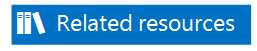

# General ledger roadmap 

_**Applies To:** Microsoft Dynamics AX 2012 R3, Microsoft Dynamics AX 2012 R2, Microsoft Dynamics AX 2012 Feature Pack, Microsoft Dynamics AX 2012_

This topic is a roadmap to additional information about General ledger in Microsoft Dynamics AX. It includes links to information about how to get started, configure, and use General ledger, and which modules integrate with General ledger.

General ledger provides an efficient way for organizations to manage their financial records. The general ledger is a register of debit and credit entries that are classified by using the accounts and financial dimensions that are listed in the chart of accounts.

General ledger offers flexible options for setting up and maintaining shared charts of accounts, currencies, exchange rates, and fiscal calendars. You can allocate costs and income by using the period-end allocation, elimination, and multicompany consolidation processes. You can quickly inquire and report on ledger transactions and account balances, and use financial dimensions to analyze your organization’s financial data from a variety of perspectives.

General ledger also covers fixed assets, cost accounting, cash flow forecasting, currency requirement projections, and country/region-specific capabilities. Other capabilities include audit workbench, budget control, compliance management, and shared services.

This topic includes links to important information about how to set up and use General ledger.

<table>
<colgroup>
<col style="width: 50%" />
<col style="width: 50%" />
</colgroup>
<tbody>
<tr class="odd">
<td>

Get started

Configure

Use

Reports

Integration with General ledger

Still didn’t find what you were looking for?
</td>
<td>

<a href="http://go.microsoft.com/fwlink/?linkid=507515">Planning your chart of accounts in AX 2012</a> (blog)

<a href="http://go.microsoft.com/fwlink/?linkid=397377">Shared Financial Data Management for Microsoft Dynamics AX 2012 R2</a> (white paper)

<a href="http://go.microsoft.com/fwlink/?linkid=397378">Implementing the account and dimensions framework</a> (white paper)

<a href="financial-consolidations-and-currency-translation.md">Financial consolidations and currency translation by using Management Reporter</a> (white paper)

<a href="http://blogs.msdn.com/b/dynamics_financial_reporting/">Dynamics Financial Reporting</a> (blog)

<a href="http://community.dynamics.com/ax/f/33.aspx">Microsoft Dynamics AX Forum</a> (forum)

<a href="http://www.microsoft.com/en-us/download/details.aspx?displaylang=en%26id=29210">Help and Resources Datasheet for Dynamics AX 2012</a> (download)

<a href="https://lcs.dynamics.com/home/homeindex">Lifecycle Services</a>* (cloud-based workspace)

* In order to use Lifecycle Services, you must have a CustomerSource or PartnerSource account, and have created a project. For more information, see the <a href="lifecycle-services-for-microsoft-dynamics-user-guide-lcs.md">Lifecycle Services for Microsoft Dynamics User Guide (LCS)</a>
</td>
</tr>
</tbody>
</table>

## Get started

The section includes information about General ledger and how you can set up and use it in a Microsoft Dynamics AX 2012 implementation.

<table>
<colgroup>
<col style="width: 33%" />
<col style="width: 33%" />
<col style="width: 33%" />
</colgroup>
<thead>
<tr class="header">
<th>
Task
</th>
<th>
Details
</th>
<th>
More information
</th>
</tr>
</thead>
<tbody>
<tr class="odd">
<td>
Learn about General ledger
</td>
<td>
General ledger provides a way for organizations to define and manage their financial records.
</td>
<td>
We recommend that you become familiar with the concepts described in these links before you set up and use General ledger.

<a href="general-ledger.md">General ledger</a>
</td>
</tr>
<tr class="even">
<td>
Learn what’s new in General ledger
</td>
<td>
Review new and changed General ledger features since the release of AX 2012.
</td>
<td>
<a href="what-s-new-general-ledger-features.md">What's new: General ledger features</a>
</td>
</tr>
</tbody>
</table>

Back to top

## Configure

This section provides information about how to set up General ledger.

## Prerequisites

This section provides information about what to consider before you set up General ledger.

<table>
<colgroup>
<col style="width: 33%" />
<col style="width: 33%" />
<col style="width: 33%" />
</colgroup>
<thead>
<tr class="header">
<th>
Task
</th>
<th>
Details
</th>
<th>
More information
</th>
</tr>
</thead>
<tbody>
<tr class="odd">
<td>
Plan and create organizations and organizational hierarchies
</td>
<td>
Plan and create organizations such as legal entities, operating units, and teams. The organizational hierarchies that you create represent the relationships between the organizations that make up your business. The organizational hierarchies affect the setup of the account structure in General ledger.
</td>
<td>
We recommend that you become familiar with the concepts and limitations of organizations and organizational hierarchies that are described in these links before you set up General ledger.

<a href="organizations-and-organizational-hierarchies.md">Organizations and organizational hierarchies</a>
</td>
</tr>
<tr class="even">
<td>
Plan the chart of accounts
</td>
<td>
Account structures in General ledger consist of main accounts and can include financial dimension segments. The account structures are used to define the valid combinations which, together with the main accounts, form a chart of accounts.

If two or more segments of an account structure are organization units, such as Business unit or Department, an organization hierarchy can be used to determine the valid combinations. The constraints would not have to be defined directly in the account structure.
</td>
<td>
<a href="http://go.microsoft.com/fwlink/?linkid=507724">Planning your chart of accounts in AX 2012</a>
</td>
</tr>
</tbody>
</table>

## Set up General ledger

This section lists tasks you can complete to set up General ledger.

<table>
<colgroup>
<col style="width: 33%" />
<col style="width: 33%" />
<col style="width: 33%" />
</colgroup>
<thead>
<tr class="header">
<th>
Task
</th>
<th>
Details
</th>
<th>
More information
</th>
</tr>
</thead>
<tbody>
<tr class="odd">
<td>
Set up required General ledger information
</td>
<td>
Set up ledgers, enable interunit accounting, and create currency codes.
</td>
<td>
<a href="set-up-a-ledger.md">Set up a ledger</a>

<a href="enable-interunit-accounting.md">Enable interunit accounting</a>

<a href="create-a-currency-code.md">Create a currency code</a>

<a href="example-balanced-accounting-entry-for-interunit-accounting.md">Example: Balanced accounting entry for interunit accounting</a>
</td>
</tr>
<tr class="even">
<td>
Set up the chart of accounts
</td>
<td>
Create main accounts and financial dimensions, set up charts of accounts, set up ledger account aliases, set up main account categories, and create advanced account structures.
</td>
<td>
<a href="setting-up-the-chart-of-accounts.md">Setting up the chart of accounts</a>

<a href="about-the-chart-of-accounts.md">About the chart of accounts</a>

<a href="about-main-account-types.md">About main account types</a>

<a href="create-a-main-account.md">Create a main account</a>

<a href="create-a-financial-dimension.md">Create a financial dimension</a>

<a href="create-consolidation-groups-and-additional-consolidation-accounts.md">Create consolidation groups and additional consolidation accounts</a>

<a href="set-up-a-chart-of-accounts.md">Set up a chart of accounts</a>

<a href="about-the-configure-account-structures-form.md">About the Configure account structures form</a>

<a href="set-up-a-ledger-account-alias.md">Set up a ledger account alias</a>

<a href="set-up-main-account-categories.md">Set up main account categories</a>

<a href="main-account-categories-and-analysis-cubes.md">Main account categories and analysis cubes</a>

<a href="create-advanced-account-structures-and-rules-for-a-chart-of-accounts.md">Create advanced account structures and rules for a chart of accounts</a>

<a href="create-advanced-account-structures-and-rules-for-budget-planning.md">Create advanced account structures and rules for budget planning</a>

<a href="link-main-accounts-to-main-account-categories.md">Link main accounts to main account categories</a>

<a href="create-a-financial-dimension-default-template.md">Create a financial dimension default template</a>

<a href="create-a-financial-dimension-set.md">Create a financial dimension set</a>
</td>
</tr>
<tr class="odd">
<td>
Set up and maintain journals
</td>
<td>
Create ledger accrual transactions, post and print journals or journal lines, post multiple journals, set up financial journal approvals, delete posted ledger journals, set up General ledger workflows, set up posting restrictions, and approve journals.
</td>
<td>
<a href="setting-up-and-maintaining-journals.md">Setting up and maintaining journals</a>
</td>
</tr>
<tr class="even">
<td>
Set up posting
</td>
<td>
Set up posting definitions, create accrual schemes, and create and validate journals and journal lines.
</td>
<td>
<a href="about-posting-definitions.md">About posting definitions</a>

<a href="examples-posting-definitions.md">Examples: Posting definitions</a>

<a href="set-up-posting-definitions.md">Set up posting definitions</a>

<a href="set-up-default-descriptions-for-automatic-posting.md">Set up default descriptions for automatic posting</a>

<a href="assign-posting-definitions-to-transaction-posting-types.md">Assign posting definitions to transaction posting types</a>

<a href="create-accrual-schemes.md">Create accrual schemes</a>

<a href="create-and-validate-journals-and-journal-lines.md">Create and validate journals and journal lines</a>
</td>
</tr>
<tr class="odd">
<td>
Set up sales tax codes
</td>
<td>
Set up sales tax codes that contain basic information about the tax amounts you collect and pay to the tax authorities.

When you set up sales tax codes, you define the amounts or percentages that must be collected. You also define the various methods by which those amounts or percentages are applied to transaction amounts.
</td>
<td>
<a href="about-the-marginal-base-field.md">About the Marginal base field</a>

<a href="about-the-sales-tax-calculation-methods-in-the-origin-field.md">About the sales tax calculation methods in the Origin field</a>

<a href="about-the-whole-amount-and-interval-options-for-sales-tax-codes.md">About the Whole amount and Interval options for sales tax codes</a>

<a href="set-up-and-use-sales-tax-codes.md">Set up and use sales tax codes</a>

<a href="create-various-kinds-of-sales-tax-codes.md">Create various kinds of sales tax codes</a>

<a href="set-up-a-sales-tax-on-a-sales-tax.md">Set up a sales tax on a sales tax</a>

<a href="setting-up-sales-tax-codes.md">Setting up sales tax codes</a>
</td>
</tr>
<tr class="even">
<td>
Set up sales tax
</td>
<td>
Set up the sales tax functionality, such as sales tax, sales tax on sales tax, packing duties, and purchase duties.
</td>
<td>
<a href="set-up-sales-tax-on-prepayments.md">Set up sales tax on prepayments</a>

<a href="set-up-a-sales-tax-settlement-period.md">Set up a sales tax settlement period</a>

<a href="set-up-conditional-sales-taxes.md">Set up conditional sales taxes</a>

<a href="about-including-sales-tax-in-journal-amounts.md">About including sales tax in journal amounts</a>

<a href="revise-the-sales-tax-amount-on-a-transaction-before-posting.md">Revise the sales tax amount on a transaction before posting</a>

<a href="assign-a-tax-exempt-number-to-a-customer.md">Assign a tax exempt number to a customer</a>

<a href="set-up-a-tax-registration-type.md">Set up a tax registration type</a>
</td>
</tr>
<tr class="odd">
<td>
Set up sales tax groups and item sales tax groups
</td>
<td>
Set up groups of sales tax codes that are attached to customers, vendors, and ledger accounts for transactions that are not posted to a particular vendor account or customer account.
</td>
<td>
<a href="set-up-and-use-a-sales-tax-group.md">Set up and use a sales tax group</a>

<a href="set-up-a-default-tax-profile-for-a-customer-or-vendor.md">Set up a default tax profile for a customer or vendor</a>

<a href="create-item-sales-tax-groups.md">Create item sales tax groups</a>

<a href="set-up-a-default-item-sales-tax-group-for-a-main-account.md">Set up a default item sales tax group for a main account</a>

<a href="set-up-ledger-posting-groups-for-sales-tax.md">Set up ledger posting groups for sales tax</a>
</td>
</tr>
<tr class="even">
<td>
Set up sales tax authorities
</td>
<td>
Set up the sales tax authorities who require that you collect sales tax on their behalf and pay those taxes regularly.
</td>
<td>
<a href="set-up-sales-tax-authorities.md">Set up sales tax authorities</a>

<a href="set-up-a-sales-tax-authority-as-a-vendor.md">Set up a sales tax authority as a vendor</a>

<a href="example-rounding-payments-made-to-sales-tax-authorities.md">Example: Rounding payments made to sales tax authorities</a>

<a href="view-or-print-sales-tax-payments-without-posting.md">View or print sales tax payments without posting</a>
</td>
</tr>
<tr class="odd">
<td>
Set up U.S. sales tax
</td>
<td>
Set up sales tax jurisdictions and other sales tax and use rules that are specific to the United States.
</td>
<td>
<a href="set-up-sales-tax-for-the-united-states.md">Set up sales tax for the United States</a>

<a href="set-up-sales-tax-jurisdictions.md">Set up sales tax jurisdictions</a>

<a href="set-up-sales-tax-groups-for-jurisdictions.md">Set up sales tax groups for jurisdictions</a>

<a href="usa-applying-u-s-sales-tax-and-use-tax-rules.md">(USA) Applying U.S. sales tax and use tax rules</a>
</td>
</tr>
<tr class="even">
<td>
Set up withholding tax
</td>
<td>
Set up withholding tax that customers have to pay vendors in many countries/regions.
</td>
<td>
<a href="set-up-withholding-tax-in-system-administration-and-general-ledger.md">Set up withholding tax in System administration and General ledger</a>

<a href="calculate-and-post-withholding-tax.md">Calculate and post withholding tax</a>

</td>
</tr>
<tr class="odd">
<td>
Set up traditional financial statements
</td>
<td>
Set up row definitions and column definitions that are used to generate, print, and export traditional financial statements.
</td>
<td>
<a href="setting-up-traditional-financial-statements.md">Setting up traditional financial statements</a>
</td>
</tr>
<tr class="even">
<td>
Set up financial reports by using Management Reporter for Microsoft Dynamics ERP
</td>
<td>
Create, maintain, deploy, and view financial reports by using Management Reporter for Microsoft Dynamics ERP (recommended) instead of using the traditional financial statements in Microsoft Dynamics AX.

Management Reporter for Microsoft Dynamics ERP lets you design financial reports based on ledger accounts and financial dimensions, drill down to transaction-level detail, and use web-based report viewing.
</td>
<td>
<a href="http://go.microsoft.com/fwlink/?linkid=324762">Management Reporter for Microsoft Dynamics ERP</a>
</td>
</tr>
<tr class="odd">
<td>
Set up financial reason codes
</td>
<td>
Set up financial reason codes that are used to record changes, such as write-down adjustments or payment reversals.
</td>
<td>
<a href="about-financial-reason-codes.md">About financial reason codes</a>

<a href="set-up-reason-codes-for-financial-modules.md">Set up reason codes for financial modules</a>
</td>
</tr>
<tr class="even">
<td>
Maintain transactions in General ledger
</td>
<td>
Create reversing entries or place General ledger transactions on hold.
</td>
<td>
<a href="create-a-reversing-entry.md">Create a reversing entry</a>

<a href="place-a-general-ledger-transaction-on-hold.md">Place a General ledger transaction on hold</a>
</td>
</tr>
<tr class="odd">
<td>
Set up fiscal calendars, fiscal years, and periods
</td>
<td>
Set up fiscal calendars, fiscal years, and periods that can be shared by multiple legal entities.
</td>
<td>
<a href="about-fiscal-calendars-fiscal-years-and-periods.md">About fiscal calendars, fiscal years, and periods</a>

<a href="key-tasks-fiscal-calendars-fiscal-years-and-periods.md">Key tasks: Fiscal calendars, fiscal years, and periods</a>

<a href="select-a-fiscal-calendar-for-a-ledger.md">Select a fiscal calendar for a ledger</a>

<a href="specify-which-users-can-post-to-a-period.md">Specify which users can post to a period</a>
</td>
</tr>
<tr class="even">
<td>
Set up information for letters of guarantee
</td>
<td>
Activate letters of guarantee, and set up payment purposes or reason codes that specify the objective of letter of guarantee transactions or agreements.
</td>
<td>
<a href="activate-the-letter-of-guarantee.md">Activate the letter of guarantee</a>

<a href="set-up-letter-of-guarantee-cancellation-reasons-and-purpose-code-types.md">Set up letter of guarantee cancellation reasons and purpose code types</a>
</td>
</tr>
</tbody>
</table>

Back to top

## Use

This section provides information about how to work with General ledger.

<table>
<colgroup>
<col style="width: 33%" />
<col style="width: 33%" />
<col style="width: 33%" />
</colgroup>
<thead>
<tr class="header">
<th>
Task
</th>
<th>
Details
</th>
<th>
More information
</th>
</tr>
</thead>
<tbody>
<tr class="odd">
<td>
Process closing transactions
</td>
<td>
Set up allocation rules and journals that you can use to allocate transactions, view posted journal entries, adjust ledger exchange transactions, journalize ledger transactions, and settle transactions between ledger accounts.
</td>
<td>
<a href="process-closing-transactions-overview.md">Process closing transactions overview</a>

<a href="allocate-transactions.md">Allocate transactions</a>

<a href="maintain-ledger-accounts.md">Maintain ledger accounts</a>

<a href="close-transactions.md">Close transactions</a>
</td>
</tr>
<tr class="even">
<td>
Allocate costs and income
</td>
<td>
Consolidate transactions, create cash flow forecasts and currency requirements forecasts, and eliminate transactions.
</td>
<td>
<a href="allocate-costs-and-income-overview.md">Allocate costs and income overview</a>

<a href="consolidate-transactions.md">Consolidate transactions</a>

<a href="forecast-cash-flow-and-currency-requirements.md">Forecast cash flow and currency requirements</a>

<a href="eliminate-transactions.md">Eliminate transactions</a>

<a href="financial-consolidations-and-currency-translation.md">Financial consolidations and currency translation</a>
</td>
</tr>
<tr class="odd">
<td>
Revalue currency amounts
</td>
<td>
Convert the accounting currency amounts to another currency on a specific date.
</td>
<td>
<a href="revalue-currency-amounts-overview.md">Revalue currency amounts overview</a>
</td>
</tr>
<tr class="even">
<td>
Close books
</td>
<td>
Complete closing procedures at the end of a month, period, or year. At the end of a period, you can close the period and prepare the accounting system for a new period.
</td>
<td>
<a href="close-books-overview.md">Close books overview</a>

<a href="closing-the-month-period-and-fiscal-year.md">Closing the month, period, and fiscal year</a>
</td>
</tr>
</tbody>
</table>

Back to top

## Reports

This section includes information about how to create, maintain, deploy, and view reports for General ledger.

<table>
<colgroup>
<col style="width: 33%" />
<col style="width: 33%" />
<col style="width: 33%" />
</colgroup>
<thead>
<tr class="header">
<th>
Item
</th>
<th>
Details
</th>
<th>
More
</th>
</tr>
</thead>
<tbody>
<tr class="odd">
<td>
Microsoft SQL Server Reporting Services reports
</td>
<td>
Several Reporting Services reports for General ledger are provided are available in the Report catalog.
</td>
<td>
<a href="general-ledger-reports.md">General ledger reports</a>
</td>
</tr>
<tr class="even">
<td>
Financial reports
</td>
<td>
To create, maintain, deploy, and view financial reports, you can use Management Reporter for Microsoft Dynamics ERP (recommended), or you can use the traditional financial statements that are included with AX 2012.
</td>
<td>
<a href="http://go.microsoft.com/fwlink/?linkid=324762">Management Reporter for Microsoft Dynamics ERP</a>

<a href="about-traditional-financial-statements.md">About traditional financial statements</a>
</td>
</tr>
<tr class="odd">
<td>
General ledger cube and Microsoft SQL Server Analysis Services reports
</td>
<td>
The General ledger cube is used to report on ledger accounts and bank accounts. Online analytical processing (OLAP) functionality is provided through the use of cubes.

These cubes, built on the Analysis Services platform, help you analyze large amounts of data and identify trends that you might not otherwise discover when you’re viewing data on traditional reports.
</td>
<td>
<a href="general-ledger-cube-ledgercube-for-microsoft-dynamics-ax-2012-r2-and-r3.md">General ledger cube (LedgerCube) for Microsoft Dynamics AX 2012 R2 and R3</a>

<a href="analytics-in-microsoft-dynamics-ax.md">Analytics in Microsoft Dynamics AX</a>
</td>
</tr>
</tbody>
</table>

Back to top

## Integration with General ledger

General ledger can be integrated with the following modules and Microsoft products:

  - [Accounts payable](accounts-payable.md)

  - [Accounts receivable](accounts-receivable.md)

  - [Budgeting](budgeting.md)

  - [Cash and bank management](cash-and-bank-management.md)

  - [Fixed assets](fixed-assets.md)

  - [Human resources](human-resources.md)

  - [Inventory management](inventory-management.md)

  - [Payroll](payroll.md)

  - [Procurement and sourcing](procurement-and-sourcing.md)

  - [Project management and accounting](project-management-and-accounting.md)

  - [Retail for application users](retail-for-application-users.md)

  - [Sales and marketing](sales-and-marketing.md)

  - [Trade allowance management](trade-allowance-management.md)

  - [Transportation management](transportation-management.md)

  - [Travel and expense](travel-and-expense.md)

  - [Warehouse management](warehouse-management.md)

  - Microsoft SQL Server Analysis Services

  - Microsoft SQL Server Reporting Services

  - Microsoft Excel

Back to top

