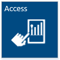

---
title: Microsoft Dynamics AX integration with Power BI for Office 365
TOCTitle: Microsoft Dynamics AX integration with Power BI for Office 365
ms:assetid: c1efcf85-e9a3-4d2d-8d24-9709e58b3fc7
ms:mtpsurl: https://technet.microsoft.com/en-us/library/Dn768397(v=AX.60)
ms:contentKeyID: 62500050
ms.date: 06/11/2014
mtps_version: v=AX.60
---

# Microsoft Dynamics AX integration with Power BI for Office 365 [AX 2012]

_**Applies To:** Microsoft Dynamics AX 2012 R3_

This article explains how to use the features and services that are included in Power BI for Office 365 to access, explore, and gain insight from your Microsoft Dynamics AX data.

<table>
<colgroup>
<col style="width: 50%" />
<col style="width: 50%" />
</colgroup>
<tbody>
<tr class="odd">
<td>

Overview of Power BI for Office 365

How Microsoft Dynamics AX integrates with Power BI for Office 365
</td>
<td>

<a href="http://www.microsoft.com/en-us/powerbi/default.aspx#fbid=skw-o4z9lps">Power BI for Office 365 (website)</a>

<a href="http://office.microsoft.com/en-us/office365-sharepoint-online-enterprise-help/power-bi-getting-started-guide-ha104103589.aspx">Power BI: Getting Started Guide (webpage)</a>
</td>
</tr>
</tbody>
</table>

## Overview of Power BI for Office 365

Microsoft Power BI for Office 365 is a collection of features and services that, together, enable you to visualize data, share discoveries, and collaborate in new ways. Familiar tools including Excel and SharePoint form the foundation of Power BI. The value of Power BI is how its features and services work together, and how the insights are securely, yet interactively shared.

.png "Power BI for Office 365")

## Access data with Excel

The features listed in the following table are part of the familiar Excel environment. These features enable you to access data and display that data in interactive charts, graphs, and maps. Some of these features have been available before, some are new, but each is now integrated into Excel and into Power BI online services.

<table xmlns="http://www.w3.org/1999/xhtml">
  <tr>
    <th> 

 </th>
    <th> 

   
	 Feature
  
 </th>
    <th> 

   
	 Description
  
 </th>
  </tr>
  <tr>
    <td>
      
    </td>
    <td> 
 <a href="http://www.microsoft.com/en-us/powerbi/home/discover.aspx#fbid=skw-o4z9lps" runat="server">Power Query</a> 
 </td>
    <td> 

   
	 Use Power Query to access data from public and corporate data sources. Power Query includes a new online search feature that helps you find public data on the Web.
  
 </td>
  </tr>
  <tr>
    <td>
      
    </td>
    <td> 
 <a href="http://www.microsoft.com/en-us/powerbi/home/analyze.aspx#fbid=skw-o4z9lps" runat="server">Power Pivot</a> 
 </td>
    <td> 

   
	 Use Power Pivot to create analytical models in the familiar Excel environment. You can mash-up data from multiple sources and analyze large amounts of data.
  
 </td>
  </tr>
  <tr>
    <td rowspan="2">
      
    </td>
    <td> 
 <a href="http://www.microsoft.com/en-us/powerbi/home/visualize.aspx#fbid=skw-o4z9lps" runat="server">Power View</a> 
 </td>
    <td> 

   
	 Use Power View to create interactive charts and graphs that help you explore and present your data visually in Excel.
  
 </td>
  </tr>
  <tr>
    <td> 
 <a href="http://www.microsoft.com/en-us/powerbi/home/visualize.aspx#fbid=skw-o4z9lps" runat="server">Power Map</a> 
 </td>
    <td> 

   
	 Use Power Map to explore and navigate data on a 3D map in Excel.
  
 </td>
  </tr>
</table>

## Collaborate in Office 365

The features listed in the following table help you share data and reports with team members who are anywhere in the world.

<table>
<colgroup>
<col style="width: 33%" />
<col style="width: 33%" />
<col style="width: 33%" />
</colgroup>
<thead>
<tr class="header">
<th>

</th>
<th>
Feature
</th>
<th>
Description
</th>
</tr>
</thead>
<tbody>
<tr class="odd">
<td></td>
<td>
<a href="http://www.microsoft.com/en-us/powerbi/home/share-collaborate.aspx#fbid=skw-o4z9lps">Power BI sites</a>
</td>
<td>
Create collaborative Power BI sites for your team to share and view reports. Larger workbook viewing is also supported so that users can view and interact with larger workbooks through the browser.
</td>
</tr>
<tr class="even">
<td></td>
<td>
<a href="http://www.microsoft.com/en-us/powerbi/home/ask-questions.aspx#fbid=skw-o4z9lps">Power BI Q&amp;A</a>
</td>
<td>
Type your questions into the Q&amp;A speech bubble for immediate answers in the form of interactive charts and graphs.
</td>
</tr>
<tr class="odd">
<td></td>
<td>
<a href="http://www.microsoft.com/en-us/powerbi/home/access.aspx#fbid=skw-o4z9lps">Power BI app</a>
</td>
<td>
Access the latest reports posted to your Power BI site from an app on your mobile device.
</td>
</tr>
</tbody>
</table>

## How Microsoft Dynamics AX integrates with Power BI for Office 365

The following diagram shows how you can use the features of Power BI for Office 365 to access, explore, and gain insight from your Microsoft Dynamics AX data.

.png "How AX 2012 R3 integrates with Power BI")

1.  **Plan**
    
    The first step in this process is to determine what data to display on your reports. For example, you’ll want to consider the following questions:
    
      - What is the business problem you’re trying to solve?
    
      - What data can provide insight into this issue?
    
    After you’ve figured out what data you want to display on your reports, determine what data sources you’ll use to access that data. You can use the following types of Microsoft Dynamics AX data sources:
    
      - OData feeds
    
      - SQL Server Analysis Services cubes
    
      - List pages
    
    You may also want to mash-up your data with other sources for deeper analysis. For example, you may want to mash-up your Microsoft Dynamics AX data with data from the Web. If so, identify those data sources, as well.

2.  **Build**
    
    After you’ve figured out what data sources you’ll use, you can build your reports and analyze data. The following articles provide examples of how to do this:
    
      - [Create a report by using Power View to connect to a cube](create-a-report-by-using-power-view-to-connect-to-a-cube.md)
    
      - [Walkthrough: Creating a PowerPivot Data Mash-up](walkthrough-creating-a-powerpivot-data-mash-up.md)
    
      - [Walkthrough: Creating a data mash-up by using Power Query](walkthrough-creating-a-data-mash-up-by-using-power-query.md)

3.  **Share**
    
    To share reports with others in your organization, see the following articles:
    
      - To display a report on a Role Center page in Enterprise Portal, see the “Display the report on a Role Center page” section of [Create a report by using Power View to connect to a cube](create-a-report-by-using-power-view-to-connect-to-a-cube.md).
    
      - To display a report in a Power BI site for Office 365, see [Power BI sites on Power BI for Office 365](http://office.microsoft.com/en-ca/office365-sharepoint-online-enterprise-help/power-bi-sites-on-power-bi-for-office-365-ha104097290.aspx?ctt=5%26origin=ha104102902).
    
      - To display a report in the Power BI app, see the “View your own reports in the Powe BI app” section of [Power BI Windows Store app help](http://office.microsoft.com/en-ca/office365-sharepoint-online-enterprise-help/power-bi-windows-store-app-help-ha104010871.aspx?ctt=5%26origin=ha104095851).

  
**Announcements:** To see known issues and recent fixes, use [Issue search](http://go.microsoft.com/fwlink/?linkid=389258) in [Microsoft Dynamics Lifecycle Services](http://go.microsoft.com/fwlink/?linkid=306505) (LCS).

