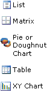

---
title: Reporting Project Overview
TOCTitle: Reporting Project Overview
ms:assetid: e3bc01b5-3b27-4909-a667-b11ddb40cc72
ms:mtpsurl: https://technet.microsoft.com/en-us/library/Cc622374(v=AX.60)
ms:contentKeyID: 28119604
ms.date: 04/17/2013
mtps_version: v=AX.60
f1_keywords:
- Microsoft.Dynamics.Framework.Design.UI.FolderNode
---

# Reporting Project Overview 

_**Applies To:** Microsoft Dynamics AX 2012 R2, Microsoft Dynamics AX 2012 Feature Pack, Microsoft Dynamics AX 2012_

A reporting project is used to create SQL Server Reporting Services reports that can be used in Microsoft Dynamics AX. The following sections provide an overview of a reporting project.

### Reporting Project in the AOT

There are two nodes in the AOT or Application Explorer that apply to Reporting Services reports.

  - **SSRS Reports** contains the report model elements such as a report that is contained in a reporting project.

  - **Dynamics AX Model Projects** under the Visual Studio Projects node contains the code and other project files for a reporting project.

The report project is accessed from the AOT or Application Explorer when you expand the **Visual Studio Projects** \> **Dynamics AX Model Projects** node, right-click the report project, and then click **Edit**. This will open the report model for edit in Visual Studio. You cannot edit a report in the developer workspace. For a list of the reporting projects in the **Dynamics AX Model Projects** node and the reports they contain, see [List of Reporting Projects](list-of-reporting-projects.md).

There is a distinction between managing reports versus managing report projects. Storing a report in the AOT happens when you add a report to a Microsoft Dynamics AX reporting project. If you want to store your reporting project or business logic assemblies for your reports in the AOT, then you must add the report project into Microsoft Dynamics AX. In the Solution Explorer, right-click the reporting project and click **Add \[project name\] to AOT**. When you add a report project to the AOT, the reporting project is added to the **Visual Studio Projects** \> **Dynamics AX Model Projects**. The following table summarizes the distinction between managing reports and managing report projects.

<table>
<colgroup>
<col style="width: 50%" />
<col style="width: 50%" />
</colgroup>
<thead>
<tr class="header">
<th>
AOT element
</th>
<th>
Description
</th>
</tr>
</thead>
<tbody>
<tr class="odd">
<td>
Reports
</td>
<td><ul>
<li>
Stored and available in the AOT when it is added to a Microsoft Dynamics AX Report Model in Visual Studio.
</li>
<li>
Can be included in any number of reporting projects.
</li>
</ul></td>
</tr>
<tr class="even">
<td>
Report projects
</td>
<td><ul>
<li>
Stored and available in the AOT when you right-click the reporting project and click <strong>Add [project name] to AOT</strong>.
</li>
<li>
Used to manage a collection of reports or report business logic assemblies.
</li>
</ul></td>
</tr>
</tbody>
</table>

The following illustration shows the AOT with the **SSRS Reports** node and the supported project types. This includes **Dynamics AX Model Projects** that store reporting model projects.

.gif "AOT view of the Dynamics AX Model Project node")

### Reporting Project in Visual Studio

In Visual Studio, from the **View** menu, click **Application Explorer** to display a tree view of the elements that are contained in the Microsoft Dynamics AX system. The **SSRS Reports** node and **Dynamics AX Model Projects** node both display in Application Explorer. The report project is accessed from the Application Explorer when you expand the **Visual Studio Projects** \> **Dynamics AX Model Projects** node, right-click the report project, and then click **Edit**.

> [!NOTE]
> 
You should open the report for edit at the Visual Studio project level. The project solution will contain any necessary dependencies for the report to build. For example, report drill-throughs require both the source and target report to be loaded in the solution to build successfully.

For information about how to create a report, see [How to: Add or Delete a Report](how-to-add-or-delete-a-report.md). The following illustration shows the layout of a reporting project in Solution Explorer in Visual Studio.

.gif "Dynamics AX reporting project layout")

### Managed Business Logic

The reporting framework supports writing business logic for reports in managed code. Supported managed languages are C\# and Visual Basic. For more information, see [Using Business Logic in Report Data Methods to Access Report Data](using-business-logic-in-report-data-methods-to-access-report-data.md). For information about how to define business logic using X++ code, see [Using Report Data Provider Classes to Access Report Data](using-report-data-provider-classes-to-access-report-data.md).

### Customizing Reports

Reporting projects can be customized, upgraded, and patched using the built-in layering support in Microsoft Dynamics AX.

To customize a report, you will edit the report in Visual Studio and when you save the changes, the customizations are added to the layer that you are currently working in. Referenced reporting projects are unpackaged and added to the solution in Visual Studio.

Reporting projects are added to the model store in a packaged format. To add a project to the AOT, in Solution Explorer, right-click a reporting project and then click **Add to AOT**. The required project items and the referenced reporting projects are stored in the model store in the layer that you are currently working in. Then you can access the reporting project in the AOT. Expand the **Visual Studio Projects** node, expand the **Dynamics AX Model Projects** node, and then find the reporting project. One Dynamics AX Model Project is created for each reporting project that is imported into Microsoft Dynamics AX. For more information, see [Integrating and Customizing Reports](integrating-and-customizing-reports.md). After a report is added, you can use them in Microsoft Dynamics AX. For more information, see [How to: Create a Menu Item for a Report](how-to-create-a-menu-item-for-a-report.md).

### Metadata

Reporting projects created in Visual Studio are stored in granular and customizable elements in the AOT called metadata. The metadata is stored in a SQL-based database and is visible in the AOT in the **Dynamics AX Model Projects**.

### Version Control

Version control is available for application projects from either the AOT or Visual Studio. For more information, see [Version Control System](https://technet.microsoft.com/en-us/library/aa639568\(v=ax.60\)).

## Deploy a Reporting Project

You can deploy reports in Visual Studio, from the AOT, or in Windows PowerShell. The following list describes what occurs when a report is deployed:

  - Uploads the Report Definition Language (RDL) to Reporting Services.

  - Copies the business logic assemblies to the Reporting Services server.

  - Verifies that referenced report and business logic assemblies are present.

To deploy an Microsoft Dynamics AX reporting project in Visual Studio, you must start Visual Studio with administrative privileges or start Microsoft Dynamics AX and the Developer Workspace with administrative privileges. To do this, you must right-click on the icon for Visual Studio or Microsoft Dynamics AX and then choose **Run as administrator**. To deploy the project in Solution Explorer, right-click the project, and then click **Deploy**.

To deploy a reporting project from the AOT, expand the **SSRS Reports** node, expand the **Reports** node, find the report to deploy, right-click the report and then click **Deploy Element**.

To deploy reports using Windows PowerShell, see [Deploy the default reports](deploy-the-default-reports.md).

## Report Model Elements

There are several model elements that are used to define a report in a model. The following table describes the main elements in a model:

<table>
<colgroup>
<col style="width: 33%" />
<col style="width: 33%" />
<col style="width: 33%" />
</colgroup>
<thead>
<tr class="header">
<th>
Element
</th>
<th>
Icon
</th>
<th>
Description
</th>
</tr>
</thead>
<tbody>
<tr class="odd">
<td>
Report
</td>
<td></td>
<td>
The report element represents a report definition. A report definition contains a collection of elements such as datasets, parameters, images, and report designs. The elements that define a report are located under the node for the report in a model. For more information, see <a href="how-to-add-or-delete-a-report.md">How to: Add or Delete a Report</a>.
</td>
</tr>
<tr class="even">
<td>
Report Data Source
</td>
<td></td>
<td>
A data source is a source of data for a report dataset. You can use the predefined data source, which connects to the Microsoft Dynamics AX application database. Or, you can define your own data sources. For more information, see <a href="how-to-define-a-report-data-source.md">How to: Define a Report Data Source</a>.
</td>
</tr>
<tr class="odd">
<td>
Dataset
</td>
<td></td>
<td>
A dataset identifies data that is displayed in a report. Every report must have one or more datasets. For more information, see <a href="how-to-define-a-report-dataset.md">How to: Define a Report Dataset</a>.
</td>
</tr>
<tr class="even">
<td>
Data Method
</td>
<td></td>
<td>
A data method contains code to retrieve and process data for a report. The code for a data method is written in C# or Visual Basic, depending on which project template is used. For more information, see <a href="how-to-define-a-data-method-in-csharp.md">How to: Define a Data Method in C#</a>.
</td>
</tr>
<tr class="odd">
<td>
Data Region
</td>
<td></td>
<td>
A data region is an area in a report that displays data. Data can be displayed in table, list, matrix, or chart formats. For more information, see <a href="how-to-add-a-data-region-to-a-report.md">How to: Add a Data Region to a Report</a>.
</td>
</tr>
<tr class="even">
<td>
Parameter
</td>
<td></td>
<td>
A parameter lets you parameterize data for a report. For more information, see <a href="how-to-define-a-report-parameter.md">How to: Define a Report Parameter</a>.
</td>
</tr>
<tr class="odd">
<td>
Filter
</td>
<td></td>
<td>
A filter is used to filter or restrict the data that is displayed in a report. For more information, see <a href="how-to-define-a-report-filter.md">How to: Define a Report Filter</a>.
</td>
</tr>
<tr class="even">
<td>
Grouping
</td>
<td></td>
<td>
A grouping lets you organize data that displays in a report by grouping fields. For more information, see <a href="how-to-define-groupings-in-a-data-region.md">How to: Define Groupings in a Data Region</a>.
</td>
</tr>
<tr class="odd">
<td>
Sorting
</td>
<td></td>
<td>
A sort lets you control the order in which data displays in a report. For example, you can sort alphabetically by field in ascending or descending order. For more information, see <a href="how-to-define-a-sorted-data-region.md">How to: Define a Sorted Data Region</a>.
</td>
</tr>
<tr class="even">
<td>
Image
</td>
<td></td>
<td>
An image can be a company logo. Or, you can display images together with the data in a report, which is common in product listings. For more information, see <a href="displaying-images-in-reports.md">Displaying Images in Reports</a>.
</td>
</tr>
<tr class="odd">
<td>
Auto Design
</td>
<td></td>
<td>
An auto design is a report design that is automatically generated based on the report data. An auto design is created by using drag-and-drop actions, and selecting elements by using Model Editor. For more information, see <a href="how-to-create-an-auto-design-for-a-report.md">How to: Create an Auto Design for a Report</a>.
</td>
</tr>
<tr class="even">
<td>
Precision Design
</td>
<td></td>
<td>
A precision design is a report design that is created by using SQL Report Designer. Precision designs are useful when a very precise layout is required. For more information, see <a href="how-to-create-a-precision-design-for-a-report.md">How to: Create a Precision Design for a Report</a>.
</td>
</tr>
<tr class="odd">
<td>
Layout Template
</td>
<td></td>
<td>
A layout template specifies the styles that are applied to the header, footer, and body of a report. One layout template can be applied to many reports. For more information, see <a href="how-to-create-a-layout-or-style-template.md">How to: Create a Layout or Style Template</a>.
</td>
</tr>
<tr class="even">
<td>
Style Template
</td>
<td></td>
<td>
A style template specifies the styles that are applied to a data region. When you create a style template, you will notice that there are several types of templates that you can create based on the data region type. A style template can be applied to more than one data region in a report, and it can be applied to data regions in more than one report. For more information, see <a href="how-to-create-a-layout-or-style-template.md">How to: Create a Layout or Style Template</a>.
</td>
</tr>
</tbody>
</table>

## See also

[How to: Create a Reporting Project](how-to-create-a-reporting-project.md)

[How to: Add a Reporting Project to a Solution](how-to-add-a-reporting-project-to-a-solution.md)

[How to: Build a Reporting Project](how-to-build-a-reporting-project.md)

[Adding a Visual Studio Project to the AOT](https://technet.microsoft.com/en-us/library/gg889206\(v=ax.60\))

