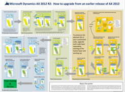

---
title: Technical diagram posters for Microsoft Dynamics AX 2012
TOCTitle: Technical diagram posters for Microsoft Dynamics AX 2012
ms:assetid: 5af8b750-b9be-4b49-becf-63fdff4d9786
ms:mtpsurl: https://technet.microsoft.com/en-us/library/Dn249831(v=AX.60)
ms:contentKeyID: 54769594
ms.date: 07/19/2016
mtps_version: v=AX.60
---

# Technical diagram posters for Microsoft Dynamics AX 2012 

_**Applies To:** Microsoft Dynamics AX 2012 R3_

Technical diagram posters provide visual representations of recommended processes and solutions for Microsoft Dynamics AX 2012.

These resources are available in Microsoft Visio (.vsd) format (Visio 2010 or Visio 2013) and PDF format. For information about how to print documents, see [Technical diagram posters for Microsoft Dynamics AX 2012](technical-diagram-posters-for-microsoft-dynamics-ax-2012.md).

You might require additional software to view these files. For more information, see the following table.

<table>
<colgroup>
<col style="width: 50%" />
<col style="width: 50%" />
</colgroup>
<thead>
<tr class="header">
<th>
File type
</th>
<th>
Software
</th>
</tr>
</thead>
<tbody>
<tr class="odd">
<td>
.vsd
</td>
<td>
Visio 2010, Visio 2013, or the free Visio viewer
</td>
</tr>
<tr class="even">
<td>
.pdf
</td>
<td>
Any PDF viewer, such as Adobe Reader
</td>
</tr>
</tbody>
</table>

The diagrams are available as PDF or Visio files that are appropriate for printing as posters.

## Posters

Each 34-by-44-inch poster describes a specific technical area. The posters have corresponding articles on TechNet. We recommend that you use the posters and articles together. These models were created by using Visio 2010. You can modify the Visio files to illustrate how you plan to incorporate Microsoft Dynamics AX 2012 into your own environment.

## Upgrade

<table>
<colgroup>
<col style="width: 50%" />
<col style="width: 50%" />
</colgroup>
<thead>
<tr class="header">
<th>
Title
</th>
<th>
Description
</th>
</tr>
</thead>
<tbody>
<tr class="odd">
<td>
<strong>Microsoft Dynamics AX 2012 R2: How to upgrade from an earlier release of AX 2012</strong>

<a href="http://go.microsoft.com/fwlink/?linkid=293672">Downloadable PDF and Visio files</a>
</td>
<td>
This poster illustrates the recommended procedure for “in-place” upgrade to Microsoft Dynamics AX 2012 R2 from either Microsoft Dynamics AX 2012 or Microsoft Dynamics AX 2012 Feature Pack. By performing most of the development and testing tasks on non-production computers, you minimize the effect of the upgrade on your production system. You work with a total of three Microsoft Dynamics AX installations: your production system, which is the basis for the other two installations, a test system, and a development system that is used to upgrade customized code. The systems are color-coded to emphasize where you are working at any given stage of the upgrade.
</td>
</tr>
</tbody>
</table>

## Updates

<table>
<colgroup>
<col style="width: 50%" />
<col style="width: 50%" />
</colgroup>
<thead>
<tr class="header">
<th>
Title
</th>
<th>
Description
</th>
</tr>
</thead>
<tbody>
<tr class="odd">
<td>
<strong>Microsoft Dynamics AX 2012 Update Process</strong>

<a href="http://go.microsoft.com/fwlink/?linkid=306776">Downloadable PDF or Visio version</a>
</td>
<td>
This poster describes the types of updates, the recommended installation order, and the detailed update process for Microsoft Dynamics AX 2012. The poster also provides tips and tricks for managing updates.
</td>
</tr>
</tbody>
</table>

## Tips for printing posters

If you have a plotter, you can print these posters at full size. If you don't have a plotter, use the following procedure to print on smaller paper.

## Print posters on smaller paper

1.  Open the poster in Visio.

2.  On the **File** menu, click **Page Setup**.

3.  On the **Print Setup** tab, in the **Printer paper** section, select the size of paper to print on.

4.  On the **Print Setup** tab, in the **Print zoom** section, click **Fit to**, and then enter **1 sheet across by 1 sheet down**.

5.  On the **Page Size** tab, click **Size to fit drawing contents**, and then click **OK**.

6.  On the **File** menu, click **Print**.

  
**Announcements:** To see known issues and recent fixes, use [Issue search](http://go.microsoft.com/fwlink/?linkid=389258) in [Microsoft Dynamics Lifecycle Services](http://go.microsoft.com/fwlink/?linkid=306505) (LCS).

